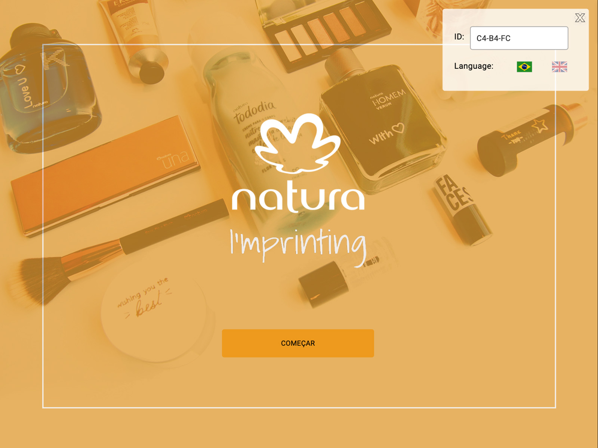

Natura Revolution - Fase 3 (I'mprinting)

# **Documentação do projeto**

Projeto de aplicação web voltada para tablet Android. Após compilada, a aplicação pode ser aberta no tablet em navegador Chrome e salva como aplicativo nativo.

# Importante

Para fins de teste, foi realizado um processo de salvamento dos IPs e IDs das máquinas diretamente num arquivo tsv no servidor. Por questão de segurança, este processo não é recomendado para ambiente final de produção e não deve ser utilizado. O método loadTexts no componente App.js carrega, além dos textos e dados de produtos, a lista de ips salvos no endereço _http://carolx.me/w/nat-server/data/ipdata.tsv_ . Altere este endereço para o endereço final do arquivo.

Os arquivos de exemplo referentes ao servidor para armazenar os IPs associados a cada máquina estão disponibilizados no repositório separado, [natura-server](https://github.com/carolinex/natura-server). **NÃO É RECOMENDADO UTILIZAR ESTE MÉTODO DEFINITIVAMENTE EM SERVIDOR DE PRODUÇÃO SEM SEM A IMPLEMENTAÇÃO DE UM SISTEMA DE TOKEN OU OUTRO MÉTODO DE SEGURANÇA**

## 1. Plataforma

O projeto em fase de testes foi projetado para rodar em tablet Android e não foi testado em outras plataformas. Algumas funcionalidades, como o redimensionamento de imagem por gesto, não estão disponíveis em Desktop. A interface é semi-responsiva, não sendo adequada para manipulação em celulares, mas pode adaptar-se a alguns formatos de tablet diferentes.

## 2. Dependências

Para desenvolvimento e deploy, é necessário ter [NodeJs](https://nodejs.org) instalado. 
As demais dependências, tais como Webpack e React, estão listadas no arquivo package.json e serão baixadas durante a instalação.

## 3. Instalação

Após clonar ou baixar este repositório, e com node/npm instalado, entre no terminal:

```bash
cd natura-rev
npm install
```
Isto deverá instalar todas as bibliotecas necessárias ao projeto. Após instalação estará incluído o diretório node_modules, que é ignorado devido à configuração do _.gitignore_

## 4. Estrutura do projeto

- _src_ : contém os arquivos fonte para desenvolvimento
  - _components_ : a aplicação está dividida em seções para cada função, para organizar o código.
  - _data_ : contém os arquivos de produtos e textos em português e inglês. O arquivo manifest.json define a orientação quando a página é salva como app nativo. Ao subir para um novo servidor, altere a propriedade href no _index.html_ para refletir o novo endereço
  - _html_ : contém somente o arquivo index.html que será usado de base para construir o aplicativo
  - _images_ : contém as imagens utilizadas, incluindo produtos, ícones e carimbos
  - _styles_ : contém os arquivos de estilo em formato scss (compilados para css no deploy)
  - _index.js_ : arquivo base de javascript

- _dist_ : os arquivos construídos para produção, ou seja, que serão disponibilizados no servidor

Além dos diretórios citados, há arquivos de configuração do webpack, postcss e pacotes de bibliotecas para instalação.


## 5. Desenvolvimento e produção
Para iniciar o servidor local, digite no terminal

```bash
npm start
```
A página será aberta no navegador em http://localhost:8080 e escutará mudanças feitas no código.

Para gerar os arquivos de produção que serão colocados no servidor online, digite no terminal:

```bash
npm run build
```
Feito isto, os arquivos serão salvos no diretório _dist_ e poderão ser repassados ao servidor.


## 6. Interface

Na tela inicial, há um ícone discreto de engrenagem no topo superior direito. Este botão está intencionalmente pouco visível, pois serve ao funcionário ou funcionária da loja configurar o tablet para a máquina específica. O ID digitado no campo indicado correponde ao ID na etiqueta afixada à máquina. A máquina está configurada para enviar seu IP ao servidor toda vez que ele for alterado, por isso ao iniciar o app, a página carrega a lista de IPs configurados e confere com o ID da etiqueta que foi digitado na interface. 

Para utilizar a mesma configuração de teste, o endereço para onde este par de ID/IP é enviado deve ser modificado em todas as máquinas quando o servidor for alterado (Lembrando que esta foi uma solução temporária e deve ser revista para ambiente final de produção).

 . . . 

Ao clicar no botão enviar da tela final, o aplicativo converte a mensagem e imagem escolhidas para GCODE e envia somente a primeira linha para a máquina associada àquele ID via websocket. Caso a máquina responda OK, o aplicativo envia a segunda linha, e assim por diante até finalizar o código. Se a resposta recebida da máquina não for OK, o aplicativo fecha a conexão com a máquina.


Para fins de debug, o GCODE enviado está sendo impresso no console do navegador.
